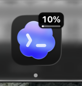

<div align="center">
  
  <h1>Codex Dock Quota</h1>
  <p>Show your remaining Codex quota directly on the ChatGPT Dock icon for macOS.</p>
  <p><a href="README.zh-CN.md">简体中文</a></p>
</div>

> [!IMPORTANT]
> This is an unofficial, experimental project. The quota reader uses OpenAI's documented [Codex App Server protocol](https://developers.openai.com/codex/app-server/), while the Dock integration relies on the current ChatGPT desktop app's internal dock-tile plugin convention and may require updates when ChatGPT changes.

## What it does

- Displays the remaining percentage and a proportional white progress bar on ChatGPT's own Dock icon—no second Dock icon.
- Reads the main `codex` quota bucket and uses the most constrained active window.
- Refreshes every 60 seconds and after the Mac wakes.
- Supports ChatGPT's light and dark Codex icons.
- Restores the previous ChatGPT Dock icon settings when the utility quits normally.
- Uses a small menu-bar item for refresh, status, opening ChatGPT, and quitting.

## Requirements

- macOS 13 or later
- The ChatGPT desktop app installed and signed in
- A ChatGPT version containing the bundled Codex App Server and `CodexDockTilePlugin`
- Swift 5.9 or later to build from source

## Build and run

### Install the release build

Download the latest [macOS DMG](https://github.com/Gxz-NGU/codex-dock-quota/releases/latest), open it, and drag **Codex Quota** into **Applications**.

The current downloadable build targets Apple Silicon (`arm64`). It is ad-hoc signed and not notarized because this project does not currently have an Apple Developer ID. If Gatekeeper blocks the first launch, Control-click the app and choose **Open**, or build it locally from source.

### Build from source

```bash
./scripts/build_app.sh
open "dist/Codex Quota.app"
```

The utility runs as an `LSUIElement` background app, so it does not create its own Dock tile. Use the gauge icon in the menu bar to refresh or quit.

## How it works

1. Locates the `codex` executable bundled inside `ChatGPT.app`.
2. Starts `codex app-server` over stdio, completes the `initialize` handshake, and calls `account/rateLimits/read`.
3. Selects `rateLimitsByLimitId["codex"]` and calculates `100 - usedPercent` from the most constrained active window.
4. Draws the percentage and proportional progress bar into copies of ChatGPT's built-in light and dark Codex icons.
5. Stores the generated PNGs in a per-user directory under `/private/tmp` and redraws them only when the displayed value changes.
6. Points ChatGPT's existing `CodexDockTilePlugin` at those images and sends its preference-change notification.

The project does **not** modify or re-sign `ChatGPT.app`, inject code into ChatGPT, read browser cookies, or require a separate OpenAI API key.

## Privacy and security

- Authentication remains owned by the bundled Codex App Server.
- The utility only parses quota-window metadata needed for the display.
- Generated icon files contain only the rendered percentage.
- No analytics or third-party dependencies are included.

## Compatibility notes

The App Server protocol is documented by OpenAI. The keys `DockIconPreference`, `DockIconResourceName`, and the notification used by `CodexDockTilePlugin` are implementation details observed in the current macOS app. If a future ChatGPT release removes or changes that plugin, the Dock integration can stop working even though quota reading still works.

If the utility exits unexpectedly and leaves a stale icon, launch it again and choose **Quit Quota Badge** from its menu-bar menu. A normal quit restores the settings captured at startup.

## Project structure

```text
Sources/CodexQuotaDock/
  CodexRateLimitClient.swift       Codex App Server JSONL client
  ChatGPTDockIconController.swift  Icon renderer and Dock plugin refresh
  main.swift                       Background app and menu-bar controls
Resources/Info.plist               macOS app metadata
scripts/build_app.sh               Release build and .app packaging
```

## License

MIT. See [LICENSE](LICENSE).

ChatGPT, Codex, and OpenAI are trademarks of OpenAI. This project is not affiliated with or endorsed by OpenAI.
