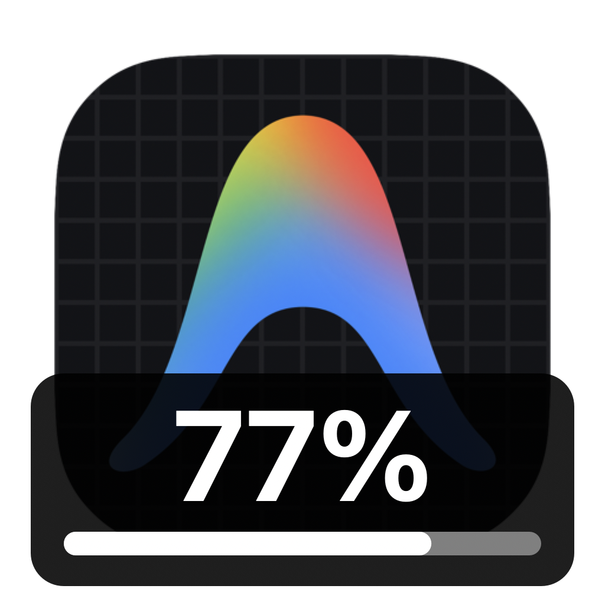

<div align="center">
  <h1>Codex Quota & Antigravity Quota</h1>
  <p>Two independent Swift menu-bar apps. Remaining quota on the original Dock icons, started on demand.</p>
  <p>
    
    &nbsp;&nbsp;
    
  </p>
  <p><a href="README.zh-CN.md">简体中文</a></p>
</div>

Images illustrate the output; percentages are not live data.

> [!IMPORTANT]
> Unofficial, experimental tools. Recent ChatGPT and Antigravity IDE icons are updated through their local Electron main-process debugger, which permits code execution inside the target app. Target application bundles are not modified or re-signed. Internal interfaces can change with app updates.

## Independent utilities

| Utility | Original Dock icon | Display | Resident processes |
| --- | --- | --- | --- |
| Codex Quota | ChatGPT | Most constrained active window of the main `codex` pool | Utility + bundled Codex App Server |
| Antigravity Quota | Antigravity IDE | Gemini shared pool's five-hour remaining quota | Utility only |

- Run either utility or both; quitting one does not stop the other.
- Separate menu-bar controls, no extra Dock tiles and no Node runtime or Node child processes.
- Quota reads every 60 seconds, manual refresh and refresh after wake.
- Gemini's menu also shows weekly quota and the five-hour reset time. The main icon does not indicate whether weekly quota remains available.
- Percentage and proportional progress bar; redraw images only when the percentage changes.
- Normal quit restores the respective icon. A 150-second watchdog restores it when updates stop.
- Memory use varies. Fewer processes do not guarantee lower memory use; quit an unused utility to stop its processes.

## Build and run

Requires macOS 13.5+ and Swift 5.9+. Built locally on Apple Silicon. Node.js is not required.

```sh
./scripts/build_app.sh

# Start only what you need
open "dist/Codex Quota.app"
open "dist/Antigravity Quota.app"
```

Sign in to the target applications first. Antigravity IDE must be running as a single instance at `/Applications/Antigravity IDE.app`; offline quota reads are unsupported. Codex requires ChatGPT's bundled App Server.

The utilities are ad-hoc signed, not notarized. They do not install login items or automatically start one another.

To migrate from AI Quota, quit the old unified utility first, or start Codex Quota and let it request a normal quit of the old utility. Then start Antigravity Quota as needed. Do not run the old unified utility alongside the new Gemini utility. The legacy `build_unified_app.sh` entry point now builds both independent apps.

`./scripts/package_release.sh` creates a separate DMG and SHA-256 file for each utility; it does not publish a release. The existing v0.1.0 release is the earlier Codex-only implementation. Build from current source for this compatibility update.

## Recent ChatGPT compatibility

The original implementation wrote `DockIconPreference` / `DockIconResourceName` and notified the Dock plugin. Recent ChatGPT also sets its running icon with `app.dock.setIcon()`, so successfully loading an image in the plugin does not prove that it is visible on the running app.

The new Electron path updates the verified main process directly and handles subsequent app icon changes and light/dark theme updates while the utility is active. Quit or watchdog expiry removes the temporary icon logic and restores the most recent icon set by the application, or the saved initial icon. Older non-Electron versions retain the legacy plugin path.

Each operation briefly opens `127.0.0.1:9229` and closes it afterward. A local file lock serializes the two utilities; an existing external debugger is not taken over. Unsupported versions report an error rather than presenting a successful quota read as a successful icon update.

## Data and privacy

- Codex uses the documented [App Server protocol](https://developers.openai.com/codex/app-server/) and `account/rateLimits/read`.
- Gemini calls the IDE language service's `RetrieveUserQuotaSummary`, selects exactly `gemini-5h`, rounds `remainingFraction × 100`, and displays weekly quota separately.
- No browser cookies or Keychain credentials are read. The local service's CSRF value is used in memory only.
- Private temporary directories contain icons and minimal quota/update metadata, removed on normal quit. No analytics.
- Debugger expressions only manipulate icons; they do not read app windows, conversations or documents.

## Tests

```sh
CLANG_MODULE_CACHE_PATH="$PWD/.build/split-module-cache" \
SWIFTPM_MODULECACHE_OVERRIDE="$PWD/.build/split-module-cache" \
swift test --scratch-path .build/split --disable-sandbox
```

Tests cover exact Gemini pool selection, 0%, invalid responses, app icon overwrites, theme changes, restoration and wrong-process rejection. Script tests do not prove visible Dock output; confirm that on the target application version. On September 13, 2026, the user visually confirmed the restored quota icon on the running ChatGPT app; normal restoration and debugger-port closure were also verified.

```text
Sources/CodexQuotaDock/        Codex quota, rendering and independent menu
Sources/AntigravityQuotaDock/  Gemini quota, rendering and independent menu
Sources/QuotaShared/           Shared Swift source; no shared background service
Tests/NativeQuotaTests/        Native tests
scripts/build_app.sh           Build both utilities
scripts/package_release.sh     Separate packages
```

MIT. See [LICENSE](LICENSE). Not affiliated with or endorsed by OpenAI or Google.
